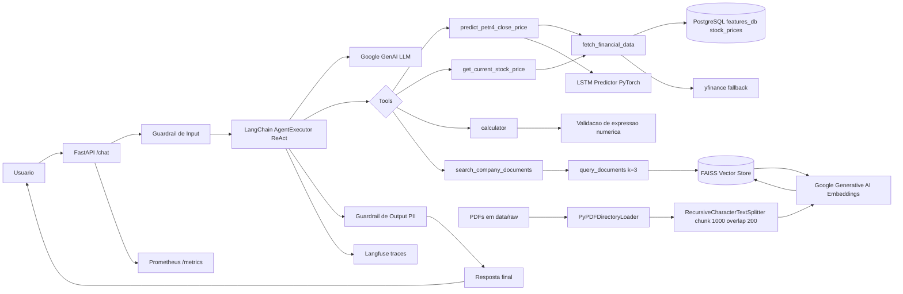
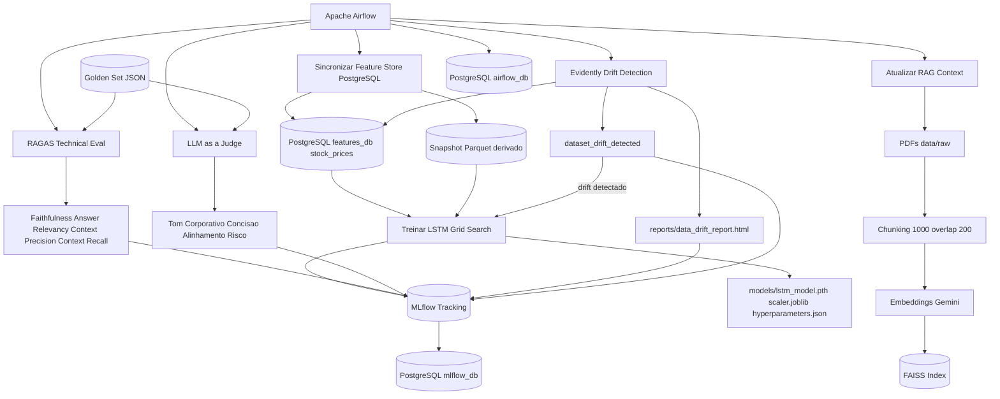

# Arquitetura da Solução

## Fluxo Online: API, Agente ReAct e RAG

## Fluxo MLOps: Treino, Avaliação e Drift

## Separação de Responsabilidades

| Camada | Componente | Responsabilidade |
| --- | --- | --- |
| Serving | FastAPI | Expor `/chat`, `/predict` e `/metrics` |
| Orquestração | LangChain ReAct | Selecionar tools e consolidar a resposta |
| Dados financeiros | `fetch_financial_data` | Sincronizar PostgreSQL canônico e fallback para `yfinance` |
| Feature/cache store | `postgres_features/features_db` | Fonte de verdade para API, agente, drift e treino |
| Snapshot de treino | `data/processed/feature_store.parquet` | Artefato derivado para auditoria, DVC e reprodutibilidade |
| RAG | FAISS + Gemini Embeddings | Busca semântica em relatórios PDF |
| Modelo preditivo | PyTorch LSTM | Prever fechamento de PETR4.SA |
| Avaliação técnica | RAGAS | Medir fidelidade, relevância e recuperação de contexto |
| Avaliação de negócio | LLM-as-a-Judge | Medir tom, concisão e alinhamento à política de risco |
| Tracking | MLflow | Registrar métricas, parâmetros e artefatos |
| Drift | Evidently | Detectar mudanças em `Close`, `Volume`, `Returns`, `Volatility` |
| Observabilidade | Prometheus, Grafana, Langfuse | Métricas de API e traces de LLM |

## Detalhes de Implementação

- **Vector Store (FAISS):** implementado em `data/processed/faiss_index` e carregado por `src/agent/rag_pipeline.py`.
- **Modelo de Embeddings:** variável de ambiente `GEMINI_EMBEDDING_MODEL` (padrão `models/gemini-embedding-001`).
- **LLM Orquestrador:** variável de ambiente `GEMINI_MODEL_NAME` (ex.: `gemma-3-27b-it`), usado pelo agente via Google GenAI.
- **MLflow Tracking:** controlado por `MLFLOW_TRACKING_URI` (no compose aponta para `http://mlflow:5000`); sem variável, o treino usa fallback local `mlruns/`.
- **Docker Compose (serviços-chave):** `api`, `airflow`, `mlflow`, `postgres_features`, `postgres_db`, `postgres_airflow`, `prometheus`, `grafana`, `loki`.
- **Health/Readiness:** API expõe `/health`, `/ready` e `/metrics` (Prometheus). O `docker-compose.yml` usa `/ready` como healthcheck.
- **Observabilidade LLM:** `langfuse` integrado via callback em `src/serving/app.py` para traces do agente.
- **Drift & Avaliação:** scripts de drift (`monitoring/drift.py`) e avaliação (`evaluation/ragas_eval.py`, `evaluation/llm_judge.py`) são executados pelas DAGs do Airflow.

