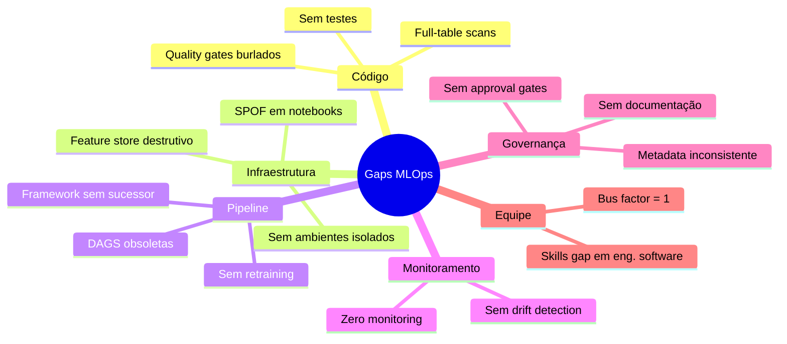
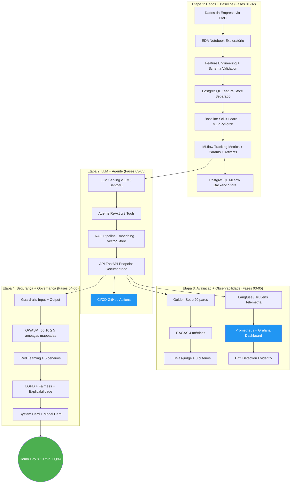

***
# Guia do Datathon - Fase 05: LLMs e Agentes

**Formato:** Datathon com Empresa Convidada
**Tipo:** Projeto Integrador (Fases 01-05)

## Por que este guia existe
O Tech Challenge da Fase 05 é o Datathon: uma competição técnica baseada em um problema real fornecido por uma empresa convidada. Diferentemente dos desafios anteriores, aqui o enunciado vem da indústria e a avaliação é composta por banca mista (empresa + academia).

Este guia de desenvolvimento traduz os gaps mais frequentes observados em plataformas de ML do mercado financeiro em orientações práticas para os grupos que enfrentam o Datathon. O objetivo é antecipar armadilhas arquiteturais, de engenharia e de governança.

O conteúdo é baseado em assessments de maturidade MLOps conduzidos em instituições financeiras reguladas e estruturado com os mesmos padrões do repositório `mlet`.

---

## Maturidade MLOps: O Que a Banca Espera
A banca avalia se o grupo atingiu pelo menos **Nível 2** do Microsoft MLOps Maturity Model nas dimensões críticas:

| Dimensão | Nível 0 (inaceitável) | Nível 1 (mínimo) | Nível 2 (esperado) |
| :--- | :--- | :--- | :--- |
| **Experiment Management** | Sem tracking | MLflow manual, metadata inconsistente | MLflow padronizado, metrics + params + artifacts |
| **Model Management** | Sem registro | Registro manual sem lineage | Model Registry com versionamento e metadata obrigatória |
| **CI/CD** | Sem pipeline | Pipeline manual, sem gates | GitHub Actions: lint → test → build → deploy (staging) |
| **Monitoring** | Sem observabilidade | Logs básicos | Métricas, drift detection, dashboard, alertas |
| **Data Management** | Dados soltos | Dados copiados manualmente | DVC/Delta Lake, versionamento, dados sintéticos em dev |
| **Feature Management**| Sem feature store | Feature store single-model | Features compartilhadas, materialização incremental |

> **Dica:** a avaliação técnica (70%) foca na demonstração de maturidade acumulada. Mesmo que o modelo final tenha métricas modestas, uma arquitetura bem governada pontuará mais que um modelo bom rodando de forma ad-hoc.

---

## Gaps Comuns em Plataformas de ML (O Que Evitar)

Os gaps abaixo são derivados de avaliações reais em plataformas de ML de instituições financeiras. Cada gap inclui o anti-padrão, o impacto e a recomendação para o Datathon.

### Taxonomia de Gaps Observados (Mindmap)


### GAP 01: Ausência de Monitoramento de Modelos
* **Anti-padrão:** Modelo é deployado e nunca mais verificado.
* **Por que importa:** A Etapa 3 exige dashboard de observabilidade. Entregar modelo sem monitoramento é o equivalente a entregar carro sem painel.
* **Recomendação:** Prometheus + Grafana para métricas operacionais; Langfuse ou TruLens para métricas de qualidade LLM (faithfulness, relevancy); Evidently para drift detection. Alertas automáticos por degradação.

### GAP 02: Notebook Compartilhado como SPOF (Single Point of Failure)
* **Anti-padrão:** Um único notebook é o trigger de produção para múltiplos modelos. Uma edição quebra tudo.
* **Por que importa:** A banca penaliza blast radius alto. Se o pipeline tem um ponto único de falha, a nota de arquitetura será afetada.
* **Recomendação:** Cada componente isolado (jobs/tasks separados). Usar DAGs ou workflows declarativos. Compute isolado por job. Tudo versionado em Git com deploy via CI/CD.

### GAP 03: Feature Store com Padrão Destrutivo (Full-Flush)
* **Anti-padrão:** Feature store com estratégia "deleta tudo, carrega tudo". Durante a janela de flush, o store está vazio.
* **Por que importa:** Se usar feature store ou cache de contexto para RAG, a atualização deve ser incremental.
* **Recomendação:** Upsert incremental em vez de FLUSHALL. Change Data Feed (Delta) ou timestamps para processar deltas.

### GAP 04: Cobertura de Testes Próxima a Zero
* **Anti-padrão:** Quality gate burlado, equipe não sabe o que é pytest.
* **Por que importa:** A rubrica exige pytest funcional, CI/CD com testes e validação de dados. Código sem testes = nota baixa.
* **Recomendação:** Pytest com `--cov-fail-under=60` no mínimo. Testes de schema (pandera), feature engineering, inferência e integração (FastAPI TestClient).

### GAP 05: Sem Governança de Versionamento de Modelos
* **Anti-padrão:** MLflow sem padronização de tags, sem lineage.
* **Por que importa:** Sem metadata padronizada, o Model Card/System Card será genérico e a governança fraca.
* **Recomendação:** Schema mínimo obrigatório para registro:
    ```python
    required_tags = {
        "model_name": str,
        "model_version": str,
        "training_data_version": str, # Hash ou versão DVC
        "model_type": str,
        "metrics": dict,
        "owner": str,
        "risk_level": str,
        "git_sha": str,
        "fairness_checked": bool,
    }
    ```

### GAP 06: Sem Detecção de Drift
* **Anti-padrão:** Nenhuma verificação de data ou concept drift.
* **Por que importa:** Critério de aceite explícito na Etapa 3.
* **Recomendação:** Evidently para report de drift. PSI como métrica principal. Integrar com MLflow.

### GAP 07: Ausência de Retraining Automatizado
* **Anti-padrão:** Modelos retreinados manualmente ou acoplamento treino-inferência.
* **Por que importa:** Demonstrar *champion-challenger evaluation* mostra maturidade acima da média.
* **Recomendação:** Retraining agendado (cron) ou event-driven (drift detectado). Validação champion-challenger antes de promover.

### GAP 08: Ambiente de Desenvolvimento sem Dados
* **Anti-padrão:** Ambiente de dev existe, mas os testes acontecem só em produção por falta de dados.
* **Por que importa:** Sem dados versionados e acessíveis para reprodução local, perde pontos em Data Management.
* **Recomendação:** DVC para versionar dados (não commitar no Git). Dados sintéticos locais (SDV, Faker) e anonimizados para staging.

### GAP 09: Skills Gap em Engenharia de Software
* **Anti-padrão:** Código sem testes, type hints, error handling ou Git flow.
* **Por que importa:** Avalia qualidade de código em documentação e pipeline.
* **Recomendação:**
    * Type hints em todas as funções.
    * Docstrings com Args e Returns.
    * Logging estruturado (nunca usar `print`).
    * `pyproject.toml` para dependências.
    * `.env` para secrets.

---

## Arquitetura de Referência


---

## Estrutura de Repositório Recomendada

```text
datathon-grupo-XX/
├── .github/workflows/ci.yml        # GitHub Actions: lint + test
├── data/                           
│   ├── raw/                        # Dados brutos (NÃO commitar, usar DVC)
│   ├── processed/                  # Dados processados
│   └── golden_set/                 # 20 pares (query, expected, contexts)
├── src/
│   ├── features/feature_engineering.py 
│   ├── models/baseline.py          # Scikit-Learn + MLP PyTorch
│   ├── models/train.py             # Pipeline de treino com MLflow
│   ├── agent/react_agent.py        # Agente ReAct
│   ├── agent/tools.py              # >= 3 tools customizadas
│   ├── agent/rag_pipeline.py       # RAG: embedding + retriever + generator
│   └── serving/app.py              # FastAPI endpoint
├── monitoring/
│   ├── drift.py                    # Evidently drift detection
│   └── metrics.py                  # Prometheus custom metrics
├── security/
│   ├── guardrails.py               # Input/output guardrails
│   └── pii_detection.py            # Presidio PII detection
├── tests/
│   ├── conftest.py                 # Fixtures compartilhados
│   ├── test_features.py            
│   ├── test_models.py
│   ├── test_agent.py
│   └── test_api.py
├── evaluation/
│   ├── ragas_eval.py               # RAGAS: 4 métricas
│   └── llm_judge.py                # LLM-as-judge: >= 3 critérios
├── docs/
│   ├── MODEL_CARD.md
│   ├── SYSTEM_CARD.md
│   ├── LGPD_PLAN.md
│   ├── OWASP_MAPPING.md            # >= 5 ameaças mapeadas
│   └── RED_TEAM_REPORT.md          # >= 5 cenários adversariais
├── notebooks/01_eda.ipynb          
├── configs/
├── docker-compose.yml              # Orquestração local
├── dvc.yaml                        # Pipeline DVC
├── .env.example                    # Template de secrets locais
├── pyproject.toml                  # Dependências (Poetry/uv)
├── Makefile                        # Atalhos: make train, make serve...
└── README.md                       # Documentação principal
```

---

## Exemplos de Código Alinhados ao Datathon

### 1. MLflow Tracking Padronizado
```python
import logging
import mlflow
import pandas as pd
from sklearn.metrics import f1_score, precision_score, recall_score, roc_auc_score
from sklearn.model_selection import train_test_split

logger = logging.getLogger(__name__)

def train_and_log(df: pd.DataFrame, target_col: str, model_name: str, model_class, model_params: dict, test_size: float = 0.2, random_state: int = 42) -> str:
    X = df.drop(columns=[target_col])
    y = df[target_col]
    X_train, X_test, y_train, y_test = train_test_split(X, y, test_size=test_size, random_state=random_state, stratify=y)
    
    with mlflow.start_run(run_name=model_name) as run:
        mlflow.log_params(model_params)
        mlflow.log_param("test_size", test_size)
        mlflow.log_param("n_samples_train", X_train.shape[0])
        
        mlflow.set_tag("model_type", "classification")
        mlflow.set_tag("owner", "grupo-XX")
        mlflow.set_tag("phase", "datathon-fase05")
        
        model = model_class(**model_params)
        model.fit(X_train, y_train)
        y_pred = model.predict(X_test)
        
        metrics = {
            "auc": roc_auc_score(y_test, y_pred),
            "precision": precision_score(y_test, y_pred, zero_division=0),
            "recall": recall_score(y_test, y_pred, zero_division=0),
            "f1": f1_score(y_test, y_pred, zero_division=0),
        }
        mlflow.log_metrics(metrics)
        mlflow.sklearn.log_model(model, "model")
        
        logger.info("Modelo %s treinado: AUC=%.4f, F1=%.4f", model_name, metrics["auc"], metrics["f1"])
        return run.info.run_id
```

### 2. Agente ReAct (Etapa 2)
```python
import logging
from langchain.agents import AgentExecutor, create_react_agent
from langchain.prompts import PromptTemplate
from langchain_community.chat_models import ChatOpenAI
from langchain.tools import Tool

logger = logging.getLogger(__name__)

REACT_PROMPT = PromptTemplate.from_template("""Você é um assistente especializado.
Use as ferramentas disponíveis para responder perguntas: {tools}
...
""")

def create_datathon_agent(tools: list[Tool], model_name: str = "gpt-4o-mini", temperature: float = 0.0) -> AgentExecutor:
    if len(tools) < 3:
        logger.warning("Datathon exige >= 3 tools. Fornecidas: %d", len(tools))
    
    llm = ChatOpenAI(model=model_name, temperature=temperature)
    agent = create_react_agent(llm=llm, tools=tools, prompt=REACT_PROMPT)
    
    return AgentExecutor(agent=agent, tools=tools, max_iterations=10, verbose=True, handle_parsing_errors=True)
```

### 3. RAGAS Evaluation (Etapa 3)
```python
from datasets import Dataset
from ragas import evaluate
from ragas.metrics import answer_relevancy, context_precision, context_recall, faithfulness
import json

def evaluate_rag_pipeline(golden_set_path: str, rag_fn) -> dict[str, float]:
    with open(golden_set_path) as f:
        golden_set = json.load(f)
        
    results = []
    for item in golden_set:
        answer, contexts = rag_fn(item["query"])
        results.append({
            "question": item["query"],
            "answer": answer,
            "contexts": contexts,
            "ground_truth": item["expected_answer"],
        })
        
    dataset = Dataset.from_list(results)
    scores = evaluate(dataset, metrics=[faithfulness, answer_relevancy, context_precision, context_recall])
    return {"faithfulness": scores["faithfulness"], "answer_relevancy": scores["answer_relevancy"], "context_precision": scores["context_precision"], "context_recall": scores["context_recall"]}
```

---

## Checklist de Entrega Final

**Etapa 1 - Dados + Baseline**
- [ ] EDA documentada com insights relevantes para o problema da empresa.
- [ ] Baseline treinado e métricas reportadas no MLflow.
- [ ] Pipeline versionado (DVC + Docker) e reprodutível.
- [ ] Métricas de negócio mapeadas para métricas técnicas.
- [ ] `pyproject.toml` com todas as dependências.

**Etapa 2 - LLM + Agente**
- [ ] LLM servido via API com quantização aplicada.
- [ ] Agente ReAct funcional com $\ge 3$ tools relevantes ao domínio.
- [ ] RAG retornando contexto relevante dos dados fornecidos.
- [ ] CI/CD pipeline funcional (GitHub Actions).
- [ ] Benchmark documentado com $\ge 3$ configurações.

**Etapa 3 - Avaliação + Observabilidade**
- [ ] Golden set com $\ge 20$ pares relevantes ao domínio.
- [ ] RAGAS: 4 métricas calculadas e reportadas.
- [ ] LLM-as-judge com $\ge 3$ critérios (incluindo critério de negócio).
- [ ] Telemetria e dashboard funcionando end-to-end.
- [ ] Detecção de drift implementada e documentada.

**Etapa 4 - Segurança + Governança**
- [ ] OWASP mapping com $\ge 5$ ameaças e mitigações.
- [ ] Guardrails de input e output funcionais.
- [ ] $\ge 5$ cenários adversariais testados e documentados.
- [ ] Plano LGPD aplicado ao caso real.
- [ ] Explicabilidade e fairness documentados.
- [ ] System Card completo.

**Demo Day**
- [ ] Pitch ≤ 10 min (Problema → Abordagem → Demo → Resultados).
- [ ] Ensaio prévio com timer.
- [ ] Backup: slides offline caso a demo falhe.
- [ ] Preparação para Q&A técnico e de negócio.

## Distribuição de Pesos na Avaliação

* **Critérios de negócio (Empresa):** 30%
* **LLM serving + agente (Fases 03-05):** 15%
* **Pipeline de dados + baseline (Fases 01-02):** 10%
* **Avaliação de qualidade (Fase 05):** 10%
* **Observabilidade + monitoramento (Fases 03-05):** 10%
* **Segurança + guardrails (Fase 05):** 10%
* **Governança + conformidade (Fase 04):** 5%
* **Documentação + arquitetura:** 5%
* **PyTorch + MLflow:** 5%
```
